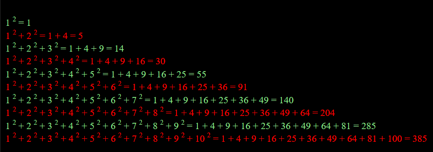

# Introduction to JSP and Servlets
### CSUEB CS-401 Software Development SP2019
 
### Screenshots



### Assignment Instructions
#### Exercise 1 – Getting Used to JSP
- a) Write a simple JSP page that prints out a series of consecutive numbers by using a Java loop construction. The output could be for example: 
```
1, 2, 3, 4, 5, 6, 7, 8, 9, 10 
```
- b) Modify your first JSP page (1a) such that it prints out the series of numbers given below using a Java loop: 
```
1, 4, 9, 16, 25, 36, 49, 64, 81, 100 
```
` c) Modify the JSP page further such that it prints in each line the sum of the squared numbers iterated through so far, as shown below: 
```
1<sup>2</sup> = 1
1<sup>2</sup> + 2<sup>2</sup> = 1 + 4 = 5
1<sup>2</sup> + 2<sup>2</sup> + 3<sup>2</sup> = 1 + 4 + 9 = 14 ... and so on 
```
- d) In order to make the list printed out by the previous JSP page easier to read, change the font color every other line. 

#### Exercise 2 – Generating a Random Number Table 
- a) Write a JSP page, which presents 75 random integer numbers from {0,1, ..., 10} in a table with 5 columns and 28 rows as follows: the random numbers are listed in the first three columns, with the sum and the average of the random numbers of a particular row given in the last two columns. Headers for the five columns (“Trial 1”, “Trial 2”, “Trial 3”, “Horizontal Sum”, “Horizontal Average”) are printed in the upper row. Finally, the sum and average of the three columns are printed in the last two rows and the according headers (“Vertical Sum”, and “Vertical Average”) are given in fourth column. 

Try to make the table easy to read by, for example, limiting the number of displayed digits, using bold fonts, choosing appropriate font and background colors. 

- b) Implement exercise 2a) as a Servlet.
- c) Modify the Servlet created in exercise 2b) so that the random numbers only change on a new session 

HINT: on a new session, initialize Random() with the current time and save time; on an existing session, initialize Random() with time saved previously in the session scope.

#### Exercise 3 – Responding to a User Request 
Write a JSP application comprising of two parts. The page “CollectUserInput.jsp” provides three fields which enable the user to specify input for a random number experiment: the number of trials Ntrial, the minimum random number Nmin, and the maximum random number Nmax. 

By clicking the “Submit” button, the “EvaluateRandomNumberExperiment.jsp” page is requested. This JSP presents these numbers, performs an experiment where Ntrial random numbers between Nmin and Nmax are drawn and lists the relative frequencies (how often this number was drawn in percent) for all the numbers between Nmin and Nmax. 
